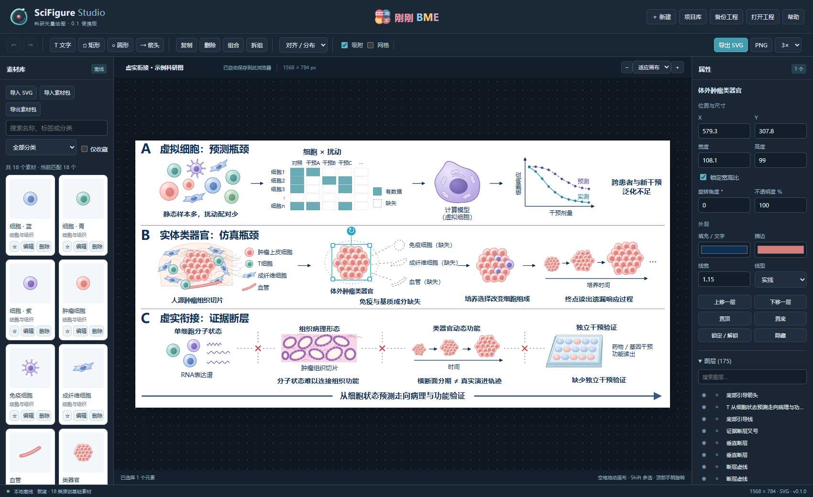

<p align="center"></p>

# SciFigure Studio

**Free, open-source scientific vector drawing — offline, editable, and extensible.**

**免费开源科研矢量绘图工具 · 刚刚BME**

[中文说明](#中文说明) · [English](#english) · [Download / 下载](https://github.com/bailong2012-rgb/SciFigure-Studio/releases) · [Report an issue](https://github.com/bailong2012-rgb/SciFigure-Studio/issues)



## 中文说明

用可编辑的细胞、组织、实验器材等 SVG 素材，拼出科研机制图和实验流程图。双击文字修改，拖动元素排版，四角缩放，上方手柄旋转。没有账号要求，无运行时依赖，也不需要付费订阅。

**当前版本：0.1.0 预览版。** 已验证 Windows Edge / Chrome；界面当前为中文。

### 开始使用

1. 在 [Releases](https://github.com/bailong2012-rgb/SciFigure-Studio/releases) 下载 `SciFigure-Studio-0.1.0-portable.zip`。
2. 完整解压，双击 `启动 SciFigure.cmd`，或用 Edge / Chrome 打开 `index.html`。
3. 点击「＋ 新建」开始绘图；通过「导入 SVG」扩充素材库。

也可以直接克隆本仓库并打开 `src/index.html`，无需构建。

### 主要功能

- **自由排版**：多选、框选、分组、拆组、图层锁定/隐藏、对齐、等距分布、吸附和撤销重做。
- **编辑文字与元素**：尺寸、旋转、颜色、透明度及文本属性；SVG 内容保持矢量。
- **扩展素材库**：18 类原创基础素材，支持批量 SVG、分类、标签、搜索、收藏和 `.sciassets` 素材包。
- **保存与导出**：多项目自动保存、工程文件备份、SVG 和最高 3× PNG 导出。
- **可扩展框架**：版本化文件格式、事件、导入和导出适配器，便于继续开发专业组件。

图稿及导入素材保存在当前浏览器，软件不主动上传它们。**换电脑、换浏览器或清理浏览器数据前，务必备份工程并导出素材包**；自动保存不会跟着便携文件夹移动。在线托管页面的访问本身仍由托管服务处理。

[完整使用指南](docs/user-guide.zh-CN.md) · [文件格式](docs/formats.md) · [扩展接口](docs/architecture.md) · [参与贡献](CONTRIBUTING.md)

### 帮助项目成长

如果它对你有帮助，欢迎点一个 **Star**，让更多科研工作者看到。欢迎通过 Issues 提交问题、素材需求和使用反馈，通过 Pull Request 贡献代码及授权清楚的原创 SVG 素材。Star 数量取决于社区使用与认可。

### 当前边界

0.1 不包含 PDF/PPTX 导出、节点级路径编辑、云同步或远程 API 服务。内置 18 类基础素材，**不是一万个现成素材**；10,000 条合成元数据已验证分页，但复杂真实素材库仍需实测。素材中的位图不能自动拆成矢量。SVG 文字依赖本机字体。详见[验证记录](docs/verification.md)。

## English

SciFigure Studio is a small, local-first scientific illustration editor from **刚刚BME (GGBME)**. Compose editable SVG assets into research diagrams, edit text, organize layers, and export SVG or PNG. No account, subscription, backend, or runtime installation is required. The current UI is Chinese.

### Quick start

Download the portable ZIP from [Releases](https://github.com/bailong2012-rgb/SciFigure-Studio/releases), extract it completely, and open `index.html` in Edge or Chrome. Alternatively:

```sh
git clone https://github.com/bailong2012-rgb/SciFigure-Studio.git
cd SciFigure-Studio
# Open src/index.html in your browser; no build step required.
```

Drag corner handles to resize; use the handle above the selection to rotate. Hold Shift for 15-degree rotation steps. Double-click text to edit. Import SVGs into a searchable, tagged library and exchange `.sciassets` packs.

Projects and assets stay in browser storage. Export backups before switching computers, browsers, or clearing site data. The portable folder does not contain your browser database. Imported SVGs are sanitized; scripts and external resources are rejected.

### For developers

The app uses native JavaScript, SVG, and IndexedDB. It can be self-hosted as static files, embedded in an iframe, or extended through the in-page `SF` namespace. **It is not a hosted REST API or a stable packaged SDK.** See [integration notes](docs/integration.md).

Build portable and source archives using Python 3.10+ (standard library only):

```sh
python build.py
```

Development tests use Playwright and Microsoft Edge on Windows:

```sh
python -m pip install -r requirements-dev.txt
python -m playwright install msedge
python tests/run_all.py
```

### License and attribution

Code: [MIT](LICENSE). Original basic science icons: CC0-1.0. Brand marks and the reconstructed demonstration figure have separate terms in [ASSET-LICENSE.md](ASSET-LICENSE.md). Third-party imports retain their own licenses. The project does not include official BioRender assets and is not affiliated with BioRender.

Contributions are welcome — see [CONTRIBUTING.md](CONTRIBUTING.md) and [ROADMAP.md](ROADMAP.md).
